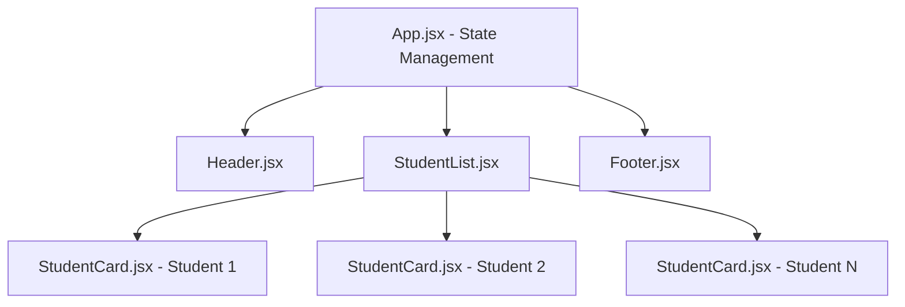

# Assignment 2: Student Information Management using Props

A modern, responsive Student Information Portal built with React and Vite, showcasing unidirectional data flow, component reusability, prop validation, and dynamic sorting by CGPA.

## 🚀 Live Demo & Running Locally

1. Navigate to the project directory:
   ```bash
   cd Assignment_2
   ```

2. Install dependencies (if not already installed):
   ```bash
   npm install
   ```

3. Launch development server:
   ```bash
   npm run dev
   ```
   Open your browser at `http://localhost:5174/` (or the port indicated in your terminal).

4. Build for production:
   ```bash
   npm run build
   ```

---

## 🏛️ Component Hierarchy & Props Flow



### 1. `App` (Root Component)
- **Role**: Manages central student data state, search query, selected department, and CGPA sort order.
- **Props Passed Down**:
  - To `Header`: `portalTitle`, `portalSubtitle`, `totalStudents`, `avgCgpa`, `highestCgpa`, `cgpaSortOrder`, `onSortChange`, `searchQuery`, `onSearchChange`, `selectedDepartment`, `onDepartmentChange`, `departments`.
  - To `StudentList`: `students` (filtered and sorted array), `currentSort`, `onResetFilters`.
  - To `Footer`: `portalTitle`, `academicYear`, `departmentCount`, `totalRecords`.

### 2. `Header`
- **Role**: Displays portal header, summary metrics (Total Enrolled, Average CGPA, Highest CGPA), interactive search bar, department dropdown filter, and CGPA sorting button group.
- **Props**: Receives all statistics and callback functions from `App`.

### 3. `StudentList`
- **Role**: Renders responsive grid of students or empty state when filters match zero records.
- **Props**: Receives `students` array and sort state. Iterates over records and passes student data as props to each `StudentCard`.

### 4. `StudentCard`
- **Role**: Reusable component rendering student information:
  - **Name**
  - **Roll Number**
  - **Department**
  - **Semester**
  - **CGPA** (with color-coded badge and visual progress bar)
  - **Photo** (avatar with fallback)
  - **Email** (with mailto quick action)
- **Props**: `name`, `rollNo`, `department`, `semester`, `cgpa`, `photo`, `email`, `batch`.

### 5. `Footer`
- **Role**: Academic portal footer displaying session year, department counts, component architecture summary, and copyright.
- **Props**: Receives metadata from `App`.

---

## 🎯 Features
- **CGPA Sorting Mechanism**: Toggle between **High &rarr; Low**, **Low &rarr; High**, and **Default** sorting order.
- **Dynamic Grade Badging**: Automatic classification (Outstanding `O`, Excellent `A+`, Very Good `A`, Good `B+`, Satisfactory `B`).
- **Live Search & Filter**: Real-time filtering by student name, roll number, or department.
- **Aesthetic UI**: Curated dark theme, glassmorphic accents, responsive grid layout, and Google Fonts (`Outfit` & `Inter`).
